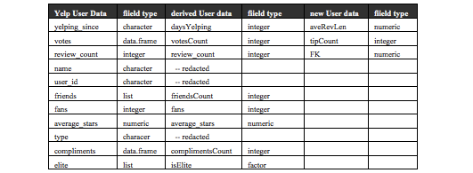
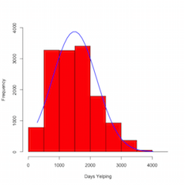

**1.	Introduction**

Since the inception of the Yelp Elite Squad program in 2005, fewer than 1% of Yelp users have ever achieved elite status, and according to the Yelp blog,  “… there is no set check list …” for attaining elite status.

In this paper, the question of selection attributes of Yelp user elite status is explored.  Can text mining and analysis of user activity/review data be employed to successfully identify and quantify a specific set of activities and relationships in order to create a model from which elite user status can be predicted? If a binomial classification model with an arbitrary 95% confidence interval can be created, then an effective ‘check list’ for elite status might be discerned from the data.  In addition to the Yelp data described below, Rstudio running on a Macbook configured with 16GB of RAM was used.  Specific configuration details are listed in the github repository for this project (https://github.com/maxgoff/YelpDataScienceProject.git).

The goal of this study is to explore and distill Yelp data in order to create a predictive model as such.  Motivation for the study was project requirements of the Capstone Course from the Johns Hopkins Data Science Certification offered through coursera.com.

**2.	Methods and Data**

___Data Ingestion and Transformation___

Data for this study, provided by Yelp(https://www.yelp.com/dataset_challenge/dataset), consists of seven files, two PDF and five JSON formatted: 

 *	Dataset_Challenge_Academic_Dataset_Agreement.pdf:  Data set terms of use
 *	Yelp_Dataset_Challenge_Terms_round_5.pdf:  Yelp Challenge terms and rules
 *	yelp_academic_dataset_business.json: Data set with reviewed business data (61,184 records).
 *	yelp_academic_dataset_checkin.json:  Data set with user ‘check in’ data (45,166 records).
 *	yelp_academic_dataset_review.json: Data set with user reviews of businesses (1,569,264 records).
 *	yelp_academic_dataset_tip.json: Data set with short user ‘tips’ (mini reviews) of businesses (495,107 records).
 *	yelp_academic_dataset_user.json: Data set with user data (366,715 records).

Each ‘record’ referenced above is a line of text.  The total size of all JSON files when unpacked is 342.2 Mb.

Methods to download, extract, and tidy the data for analytics are detailed in the github repository  associated with this study. 

After examination of the data, new fields were created and added to a modified version of the user data set to accommodate predictive modeling methods.  Additional (new) user data was generated using data from the review and tip data sets as well. The JSON formatted user data from Yelp was structured as below.  


Numeric and integer fields from the Yelp User Data were taken as is (review_count, fans, and average_stars).  Other numeric and integer fields were derived from non-numeric fields from the Yelp User data set.  For example, the yelping_since field, a character field in the original data, with values such as “2010-10” were formatted into R Date objects and used to dervie the daysYelping numeric integer field, which could then be used in model development.  The friends field, a list of user_ids, was used to create the friendsCount integer field.  The isElite factor (yes or no) was derived from the elite field, which is blank in most cases, but a list for elite users, which included the years a user had enjoyed elite status, with values such as “2005 2006 2008”.  

Once the Yelp data sets were ingested, flattened, and modified to produce all numeric and integer fields described above, a sample of 5% of all users was selected for analysis.  That set consisted of 18,335 users.   The review text from each of the sample users was then analized using the _automated_readability_index_ method from the _qdap_ package.  The Flesch Kincaid score from that analysis was used to create the _FK_ column in the final sample data set.

The _aveRevLen_ field was derived by counting the average number of characters per user from the Yelp reviews data set.  The _tipCount_ field was derived by counting the number of tips per user from the Yelp tip data set.  

Inspecting and reshaping the data was an iterative process with many steps taking several hours of processing time.  As new versions of the user data set emerged copies of the R objects were saved as native R objects to be reloaded in subsequent instatiations of Rstudio.  This was done primarily to allow for clean restarts of Rstudio to alleviate pressure on RAM, which would increase over time as additional R objects entered the environment.

Please refer to the github repository for this project for the R code developed to ingest, modify and reshape the Yelp academic data set.  

The final data set, _vfSampVector.data_, can be created by following the steps outlined in the repository.

___Methods and Models___

The goal of deriving a check list from a predictive model based on Yelp user data and related data sets implies a null hypothesis based on the statement taken from the Yelp Elite User blog:


___H~0~: There is no set check list___ 


For this study, a suitable alternative hypothesis is:

___H~a~:  A check list can be discerened via data analysis___


A binomial classification approach was used in this study.  The number of years a user was deemed to be elite was not considered; only whether the user had ever achieved elite status.  Using the final data set, vfSampVector, the isElite field was used as the response variabe for the binomial classificaiton models tested, with all numeric and integer fields used as predictor variables.  The isElite field, a factor variable, had two possible values:  no and yes.  The ‘no’ value was used as the ‘Postitive’ Class.

 The final list of variables in vfSampVector used in this study are:
\newpage

Field name |  R type 
---------- | ------------
isElite (response variable) | factor
complimentsCount  | numeric
review_count      | integer
votesCount        | integer
fans               | integer
aveRevLen          | numeric
average_stars      | numeric
FK                 | numeric
friendsCount       | integer
daysYelping       | integer 
tipCount           | integer

A number of different predictive modelling approaches from the R _caret_ package were applied to traing and cross validation sub sets selected from the vfSampVector data set.  Models tested during this study included Random Forest, Stochastic Gradient Boosting, Random Forest, Stochastic Gradient Boosting eXtreme Gradient Boosting, Stacked AutoEncoder Deep Neural Network, k-Nearest Neighbors, CART, Bagged CART, Generalized Linear Model, Quantile Regression Neural Network, Linear Discriminant Analysis, and Quadratic Discriminant Analysis. Enembles and stacks of a number of the models were also created and tested.


**3.	Results**

Using Sensitivity, Specificity, Positive and Negative Pred Value output from cross validation, one model appeared to yield the best predictive capabilities for this study: eXtreme Gradient Boosting (the xgbTree fuctnion from caret).  Some other approaches were nearly as good with Sensitivity exceeding 0.97, but in this study Specificity can be viewed as the predictive capability for a ‘yes’ value for _isElite_ classification.  The best Specificty of all models and ensembles tested was produced by the xgbTree model with a __Specificity value of 0.8395__.
```{r echo=FALSE, cache=FALSE, results=FALSE, warning=FALSE, comment=FALSE, warning=FALSE, include=FALSE} 
load('ydata/xgbCM.data')
load('ydata/xgbFit.data')

library(caret)
library(lattice)
library(ggplot2)
library(xgboost)
library(plyr)
```
```{r}
xgbCM$table
xgbCM$overall
xgbCM$byClass
```
The model produced a confidence interval greater than 95% (AccuracyLower and AccuracyUpper).  An ordered list of the independent variables from the model might be construed as a draft check list for achieving elite status:

```{r}
varImp(xgbFit)
```
The first three variables on the draft check list merit further analysis. Each of the three, complimentsCount, review_count, and votesCount, represent the total number of each for each user.  It is obvious that some normalization of data must occur in order to compare users who vary by length of time as Yelp users.  The range for daysYelping across the training data set is  288 to 4,032, with a standard deviation of 714.91.  



A form of normalization of the three independent variables in question can be attained by dividing each variable by the daysYelping value for each user.  The summary values resulting provides additional insights into the draft check list.

If we presume that compliments and votes are applied to reviews, then it follows an analysis of the relative frequency of _reviews_count_ should provide some further basis for comparison.  If we compare _reviews_count_ for elite users from the training data with reviews_count for all other users from the same data set, the following picture emerges:

quintile  |regular |  elite
-------- | ------------- | ---------
1st Qu     |   0 | 0.01232
Median     |   0 | 0.03202
Mean  |  0.01324 | 0.1608
3rd Qu | 0.001178 | 0.08478

Elite users write reviews much more frequently than users who do not attain elite status.  On average, __elite users write 6.31 times more reviews per day__ than do their non-elite peers.  The considerably larger base of reviews provide a broader foundation from which compliments and votes from other users are then realized.

**4. Discussion**

___A Common Sense Conclusion___

A common sense response to the question of how to achieve elite status on Yelp would very likely be for users to simply offer more content.  Yelp as a service is entirely dependent on users to provide reviews of businesses.  User content is therefore of prime importance to Yelp.  It therefore follows that any selection committee determining Yelp elite status would focus on the volume of contribution provided by users as a vital component of each user's profile.  Whether consciously or subconsciously, the Yelp elite user selection committee and processes must begin with a bias for those users who write the most reviews on average.

From reviews come other characteristics, such as compliments, votes, fans, and average stars.  Taken together, the ordered list of independet variables considered in this study provides a reasonable check list for users to apply to their Yelp activities, if elite status is something they would achieve.

A summary of elite user averages divided by regular user averages from the training data set for each of the independet variables is:

Independent Variable | Elite over Regular
------ | --------------
Compliments       |      12.471642
Reviews           |       6.306535
Votes             |      10.607379
Fans              |      10.573826
Review Length     |       1.512041
Average Stars     |       1.012597
Flesch Kincaid    |       1.736037
Friends           |       8.233306
Days Yelping      |       1.512812

Support for the common sense conclusion above is supported by the ratios.  It follows that more reviews from a given user provides a foundation upon which more compliments, votes, friends and fans accumulate.  The relationship amongst those variables is clear from the average of averages.  The length of each elite user review is, on average, 50% greater than those of non-elite peers.  The Flesch Kincaid score is also 70% higher for elite users, indicating a slightly greater educated target reader than non-elite users.

Although users interested in attaining elite status might view a Specificity value of 83.95% as an insufficient probability for assuring elite status, attention to the implicaitons of the independent variables used in this study would almost certainly prove to be of far greater value than having no check list whatsoever.

The check list that emerges from this study appears below.  The 3rd quitile for each summary average for elite users was taken to prescribe the target list:

Activity  |  Performance Level
-------- | -------------
Write a review |  5 or more per month
Characters per review | at least 1095
Target reading level | 5th grade
Vote on other reviews | at least 16.2 per month
Get a compliment | at least 2.5 per month
Make a friend | at least 1 per month
Get a fan  | at least 1 per quarter

The analysis of the data, which resulted in a predictive model with a 95% confidence interval, held to a common sense rubric, leads to the conclusions that if users follow the check list above as a measure of performance, the probability of attaining Yelp elite user status is greater than 80%.